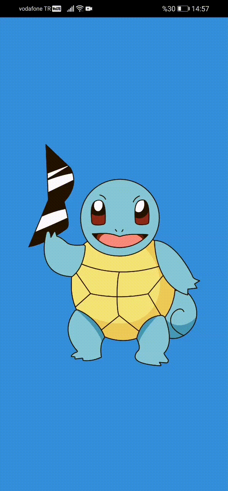
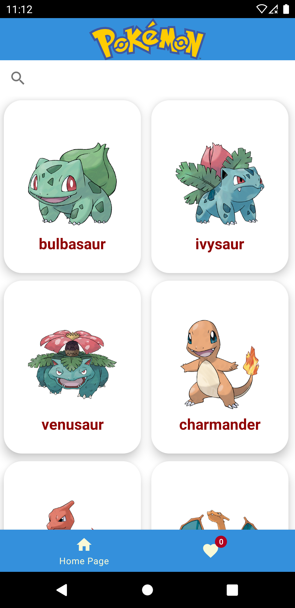
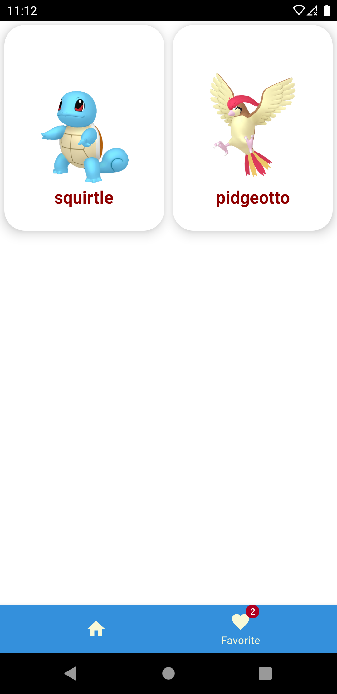
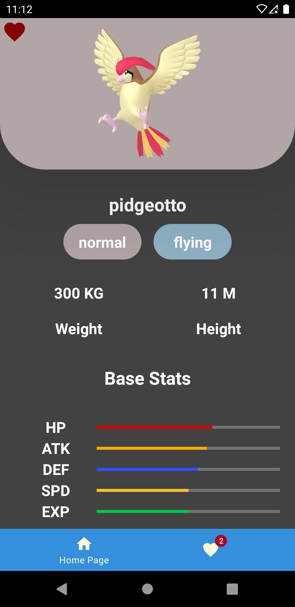
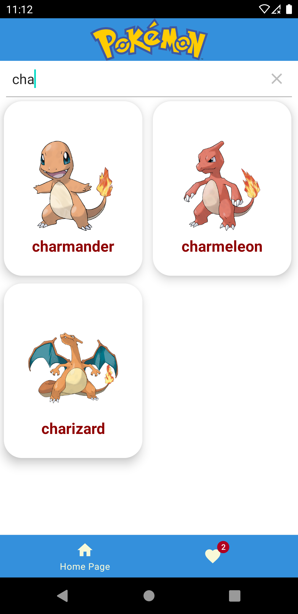

<h1>Pokemon API</h1>
 

 
<h2><b>- Fragment</b>
 
<b>- Navigation Component(NavGraph, BottomNav)</b>
 
<b>-MVVM</b>
 
<b>-Retrofit</b>
 
<b>-SQLite</b>
 
<b>-Lottie Animations</b>
 
<b>-SeachView</b></h2>
<h3>Home Page</h3>

 
<h3>Fav Page</h3>

 
<h3>Details Page</h3>

 
<h3>Search Page</h3>

 

